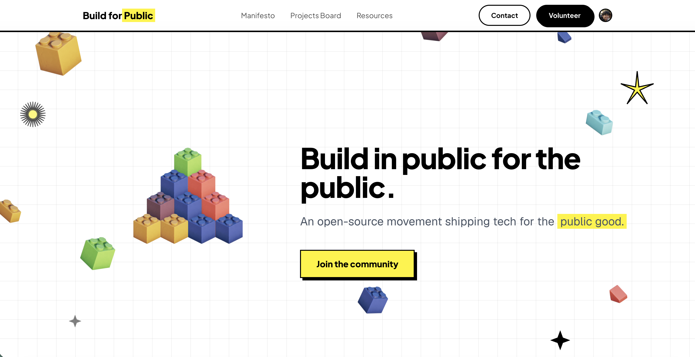

<p align="center">
  
</p>

<h1 align="center">Build for Public</h1>
<p align="center"><em>Build in public for the public.</em></p>

<p align="center">
  <a href="LICENSE"></a>
  
  
  <a href="https://buildforpublic.com"></a>
</p>

---

**Live site:** [buildforpublic.com](https://buildforpublic.com)

## What is this?

Build for Public is an open-source movement shipping tech for the public good. We connect volunteer builders — developers, designers, and advocates — with NGOs, nonprofits, and community organisations that need software but can't afford to commission it.

AI is handing humanity almost unimaginable power. But right now, most of it is driven by private interest, designed to capture attention and maximise profit rather than serve the public. We need a parallel ecosystem — one that runs on non-commercial incentives, where technology is accessible, transparent, and built for everyone.

Every project we build is encouraged to be open and built in public. We champion a culture of keeping the tools we build public, free, and open.

## What we do

### Volunteer builders
Developers, designers, students, and self-taught hackers who want their work to matter beyond a paycheck. We form teams, take on real NGO problems, and ship tools that serve communities private capital won't touch.

### NGO partnerships
We work with NGOs, nonprofits, public-sector orgs, and community groups facing problems that technology could help solve. Free, open-source, built together — all we ask is a point of contact for a few short review calls.

### Projects board
A public directory of open opportunities — NGO requests, project ideas, open-source projects, and community builds. Anyone can browse, pick up, and contribute.

## Projects

| Project | Description |
|---------|-------------|
| [OpenNGO](https://open-ngo.vercel.app) | A public directory of Malaysian NGOs with structured data, search, and an open API |
| [Bookshelf](https://bookshelf.buildforpublic.com) | Turn your reading library into a shareable poster |
| [Pocket of Pink](https://pocketofpink.com) | Gender empowerment for young people through art and education |
| [AI Adoption by Country](https://aiadoption-gray.vercel.app) | Interactive visualization + open data tracking AI adoption across 16 countries |

## Tech stack

| Layer | Tech |
|-------|------|
| Framework | Next.js 15 (App Router) |
| Backend | [Convex](https://convex.dev) |
| Auth | [Clerk](https://clerk.com) |
| Styling | Tailwind CSS |
| Animations | Framer Motion |
| Email | Resend |
| Hosting | Vercel |

## Get involved

**Builders** — volunteer your skills to ship public-interest tech. [Apply here →](https://buildforpublic.com/volunteer)

**NGOs & community orgs** — have a problem technology could help with? [Submit a request →](https://buildforpublic.com/request)

**Follow us** — [@build4public](https://x.com/build4public) on X · [@build4public](https://instagram.com/build4public) on Instagram

## Run locally

```bash
git clone https://github.com/mfrashad/buildforpublic
cd buildforpublic
npm install
npx convex dev   # runs the Convex backend
npm run dev      # runs the Next.js frontend
```

You'll need a `.env.local` with your Convex, Clerk, and Resend credentials.

## License

[AGPL v3](LICENSE) — we recommend this licence for public-interest projects so the community can always contribute. Private/closed is fine for orgs with operational or safety reasons.
